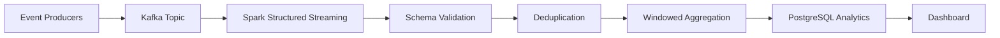

# Streaming Architecture

```mermaid
flowchart LR
  A[Event Producers] --> B[Kafka Topic]
  B --> C[Spark Structured Streaming]
  C --> D[Schema Validation]
  D --> E[Deduplication]
  E --> F[Windowed Aggregation]
  F --> G[PostgreSQL Analytics]
  G --> H[Dashboard]
```

Events are keyed by `event_id`. Watermarks limit late-event state retention, while one-minute windows produce near-real-time revenue aggregates.
